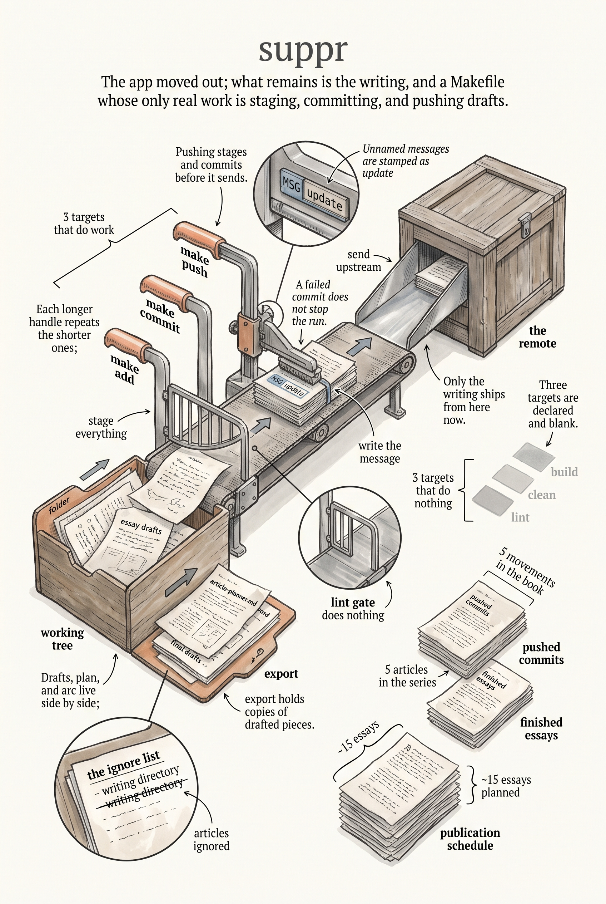

# suppr

Writing repo for the suppr project — a restaurant recommendation and
management app for two — and the **Small Batch Apps** book and article series
about building it.

The suppr application code (Wails desktop app, PWA, and API server) no longer
lives in this submodule. What remains here is the writing.

## Contents

- `articles/` — the Small Batch Apps writing
  - `article-planner.md` — the article series plan, status of each piece, and
    the publication schedule
  - `book-arc.md` — the five-movement book architecture (Jacquard imprint)
  - `final-drafts/` — the canonical markdown for the finished essays
  - `export/` — exported copies of drafted articles
- `Makefile` — housekeeping targets for staging, committing, and pushing

## Make

There is nothing to compile here; the targets are git housekeeping.

```fish
make add                  # git add -A
make commit MSG="note"    # add and commit (MSG defaults to "update")
make push MSG="note"      # add, commit, and push
```

`build`, `clean`, and `lint` exist as targets but do nothing.


