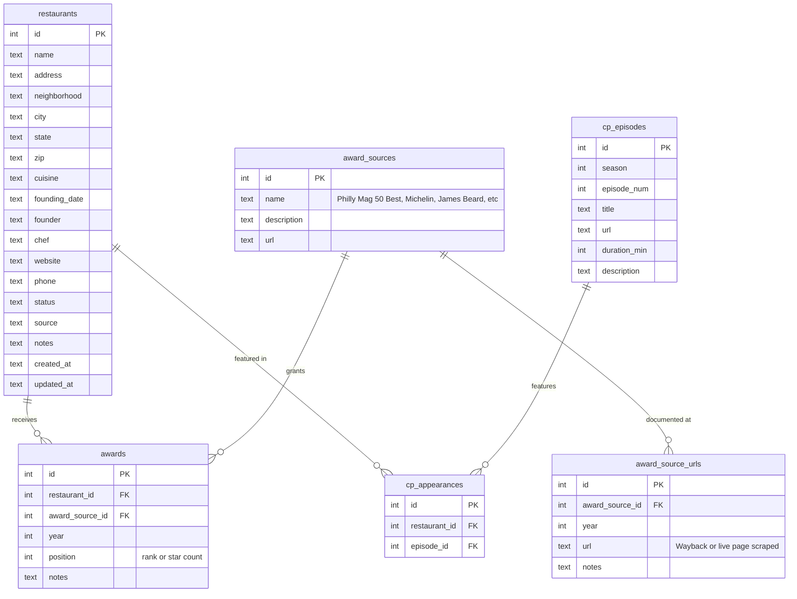

```mermaid
erDiagram
    restaurants {
        int id PK
        text name
        text address
        text neighborhood
        text city
        text state
        text zip
        text cuisine
        text founding_date
        text founder
        text chef
        text website
        text phone
        text status
        text source
        text notes
        text created_at
        text updated_at
    }

    award_sources {
        int id PK
        text name "Philly Mag 50 Best, Michelin, James Beard, etc"
        text description
        text url
    }

    award_source_urls {
        int id PK
        int award_source_id FK
        int year
        text url "Wayback or live page scraped"
        text notes
    }

    awards {
        int id PK
        int restaurant_id FK
        int award_source_id FK
        int year
        int position "rank or star count"
        text notes
    }

    cp_episodes {
        int id PK
        int season
        int episode_num
        text title
        text url
        int duration_min
        text description
    }

    cp_appearances {
        int id PK
        int restaurant_id FK
        int episode_id FK
    }

    restaurants ||--o{ awards : "receives"
    award_sources ||--o{ awards : "grants"
    award_sources ||--o{ award_source_urls : "documented at"
    restaurants ||--o{ cp_appearances : "featured in"
    cp_episodes ||--o{ cp_appearances : "features"
```
