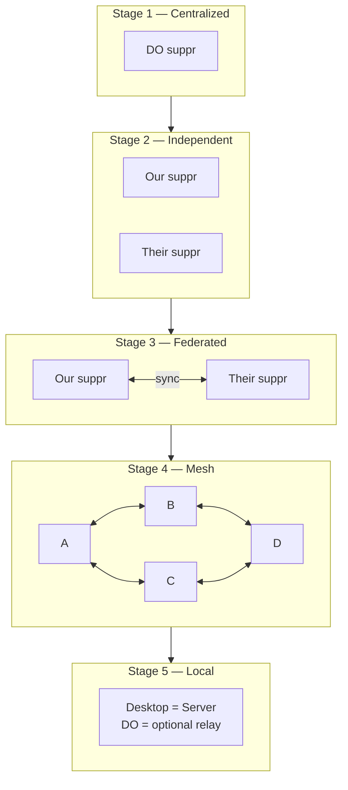
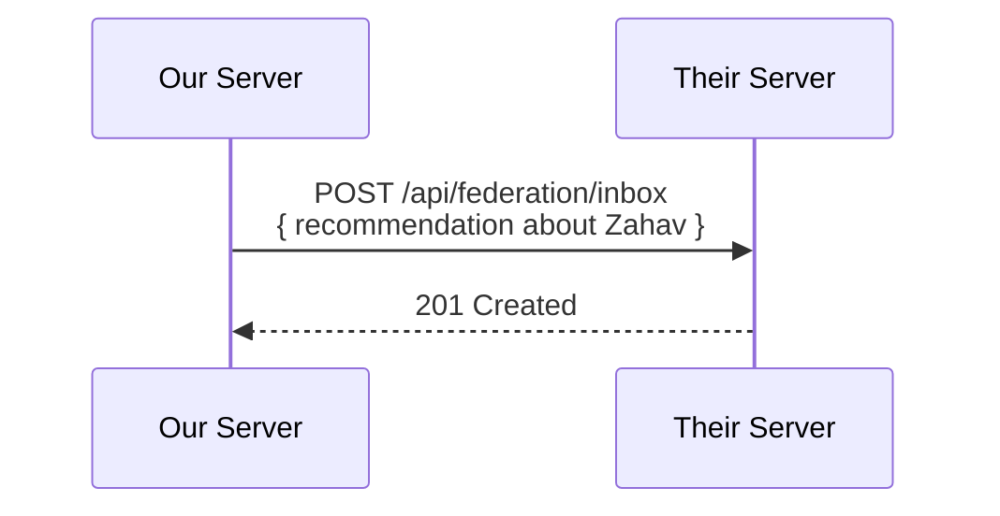

# Federation

This chapter specifies how suppr instances communicate with each other. Federation is not part of the initial build — it's Phase 6, after the single-instance app is stable and proven. But architectural decisions made early (SQLite, Go binary, API-first, API key auth, PATCH semantics) make federation a natural extension rather than a rewrite.

---

## The Path



	Stage 2 is free — deploy the same binary twice. Stage 3 is the real work: ~500 lines of Go. Stages 4 and 5 are future possibilities enabled by the same protocol.

---

## Why This Architecture Enables Federation

	1. **SQLite, not Postgres.** Each node is a single file. Runs on a VPS, a laptop, a Raspberry Pi.
	2. **Go binary.** Cross-compile for any platform. Single binary that runs anywhere.
	3. **API-first.** The Wails app already talks via HTTP. Federation is just another HTTP client — one server talking to another.
	4. **API key auth.** Easy to extend to inter-node auth. A peer authenticates with an API key just like a user.
	5. **PATCH semantics.** Partial updates transfer cleanly between nodes.

---

## What Flows Between Nodes

	Federation means sharing recommendations without merging databases. Each couple keeps their own data. What flows is a curated feed.

### Shareable

| Type | Format | Direction |
|------|--------|-----------|
| Restaurant discovery | Name, cuisine, neighborhood, why we liked it | Push to peers |
| Rating signal | "We went to X, rated it 4/5" — no details unless chosen | Push to peers |
| Photo | A dish photo with restaurant context | Push to peers (optional) |
| Intel | "X closed" or "X opened a second location" | Push to peers |

### Private (Never Shared)

| Type | Why |
|------|-----|
| Visit dates and frequency | Schedule is private |
| Spend amounts | Financial privacy |
| Personal notes | Stays between the couple |
| Lists | Curated for you specifically |
| Full recommendation history | The algorithm is personal |

---

## The Message Format

	A recommendation share is a signed JSON message:

	```json
	{
	  "type": "recommendation",
	  "from": {
	    "node": "suppr.trueblocks.io",
	    "couple": "Jay & Meriam"
	  },
	  "restaurant": {
	    "name": "Zahav",
	    "cuisine": "Israeli",
	    "neighborhood": "Society Hill",
	    "city": "Philadelphia",
	    "state": "PA",
	    "website": "https://zahavrestaurant.com"
	  },
	  "signal": {
	    "rating": 5,
	    "visitCount": 3,
	    "lastVisit": "2026-04",
	    "tags": ["date-night", "special-occasion"],
	    "note": "The lamb shoulder is life-changing. Get the whole thing."
	  },
	  "ts": "2026-05-17T14:30:00Z",
	  "sig": "..."
	}
	```

	The receiving node uses this to:
- Match against their own restaurant database (by name + city, fuzzy)
- Create a new restaurant record if no match exists
- Store the recommendation as Intel ("Jay & Meriam recommend this")
- Factor it into the recommendation engine (`friend_signal` bonus in Tonight scoring)

---

## Peer Management Endpoints

	```
	GET    /api/peers                → list linked peers
	POST   /api/peers                → invite a peer (generates a pairing token)
	POST   /api/peers/accept         → accept an invitation (validates token)
	DELETE /api/peers/:id            → unlink a peer (preserves received data)
	GET    /api/peers/:id/feed       → what they've shared with us
	POST   /api/peers/:id/share      → share something with them
	```

	Pairing works like Bluetooth: one side generates a token (or QR code), the other enters it. Both sides now have each other's endpoint and a shared key. No central directory, no account creation, no platform.

### Domain-Specific Trust

	Trust is not binary — it's per-cuisine. You might trust Jen on seafood and Thai but not on Korean. The system tracks hit rate: if Jen recommended 5 Thai places and you loved 4 of them, her Thai signal is strong. If she recommended 3 Korean places and you were meh on all of them, her Korean signal is weak.

	Stored in the Peers table as a JSON `trust_domains` field:

	```json
	{
	  "thai": { "recommended": 5, "liked": 4, "weight": 0.8 },
	  "korean": { "recommended": 3, "liked": 0, "weight": 0.0 },
	  "seafood": { "recommended": 2, "liked": 2, "weight": 1.0 }
	}
	```

	The `friend_signal` scoring component uses this weight: `friend_signal = base_friend_weight × domain_trust_weight`. A cuisine with no history gets the default weight (0.5 — cautious trust). Hit rate updates automatically after each visit to a friend-recommended restaurant.

	Trust is one hop. No transitive trust. Jen can't propagate Maria's opinion through her node — she can only manually forward it as her own recommendation (at which point it's weighted by YOUR trust of Jen, not of Maria).

---

## Sync Protocol

	Federation is **push-based, not pull-based**. When you share a recommendation, your server POSTs it to the peer's inbox. No polling, no subscription, no WebSocket.



	If the peer is offline, the message is queued locally in the Outbox and retried with exponential backoff. Messages are idempotent (keyed by content hash), so duplicates are harmless.

---

## Schema Additions

	```sql
	CREATE TABLE Peers (
	    peerID       INTEGER PRIMARY KEY,
	    name         TEXT NOT NULL,
	    endpoint     TEXT NOT NULL,
	    shared_key   TEXT NOT NULL,
	    status       TEXT DEFAULT 'active',
	    trust_domains TEXT DEFAULT '{}',
	    created_at   TEXT DEFAULT (datetime('now'))
	);

	CREATE TABLE Outbox (
	    outboxID     INTEGER PRIMARY KEY,
	    peerID       INTEGER NOT NULL REFERENCES Peers(peerID),
	    message      TEXT NOT NULL,
	    status       TEXT DEFAULT 'pending',
	    attempts     INTEGER DEFAULT 0,
	    last_attempt TEXT,
	    created_at   TEXT DEFAULT (datetime('now'))
	);

	CREATE TABLE Inbox (
	    inboxID      INTEGER PRIMARY KEY,
	    peerID       INTEGER NOT NULL REFERENCES Peers(peerID),
	    message_hash TEXT NOT NULL UNIQUE,
	    message      TEXT NOT NULL,
	    processed    INTEGER DEFAULT 0,
	    created_at   TEXT DEFAULT (datetime('now'))
	);
	```

---

## Codebase Additions

	Federation is additive — it doesn't change existing code.

| New | Purpose |
|-----|---------|
| `internal/api/federation.go` | Inbox handler, outbox sender, peer management endpoints |
| `internal/db/peers.go` | Peers table, outbox queue, inbox log |
| `pkg/models/federation.go` | Recommendation, Intel, and Peer types for federation messages |

---

## The Desktop Becomes the Server

	In the fully realized version, the Wails desktop app doesn't need DO at all:

	1. The Go backend runs a chi server on a local port
	2. The PWA connects directly (on the home LAN or via tunnel)
	3. Federation messages go directly between desktop apps

	```
	Today:   Wails app → pkg/client/ → HTTP → DO server → SQLite
	Future:  Wails app → internal/db/ → SQLite (local)
	         + federation layer ↔ other Wails apps
	```

	The app can work in any mode:
- **Hosted**: API on DO, clients connect remotely (Phase 1–5)
- **Local**: Database on laptop, PWA connects on LAN
- **Hybrid**: Database on laptop, DO acts as relay for federation when laptops sleep

---

## Timeline

| Stage | Trigger | Work |
|-------|---------|------|
| 1 (Current) | Now | DO server, 2 users, done |
| 2 (Second couple) | A friend says "I want this" | Deploy same binary again. Zero code changes. |
| 3 (Federation) | Both couples want to share | ~500 lines: inbox, outbox, peer table, share button |
| 4 (Groups) | 3+ couples linked | Multi-peer fan-out, group weighting |
| 5 (Local mode) | Architecture proven | Desktop becomes server. DO becomes optional. |

	The key insight: **the API is the same either way.** Whether the server runs on DO or on a laptop, the endpoints, the auth, the schema — all identical. Migration from hosted to local to federated is a deployment change, not a rewrite.
