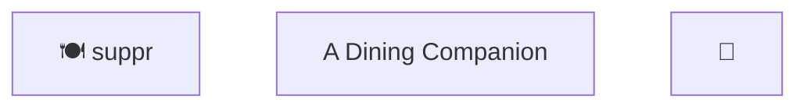
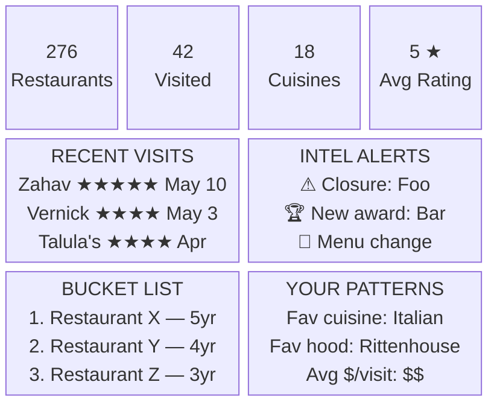
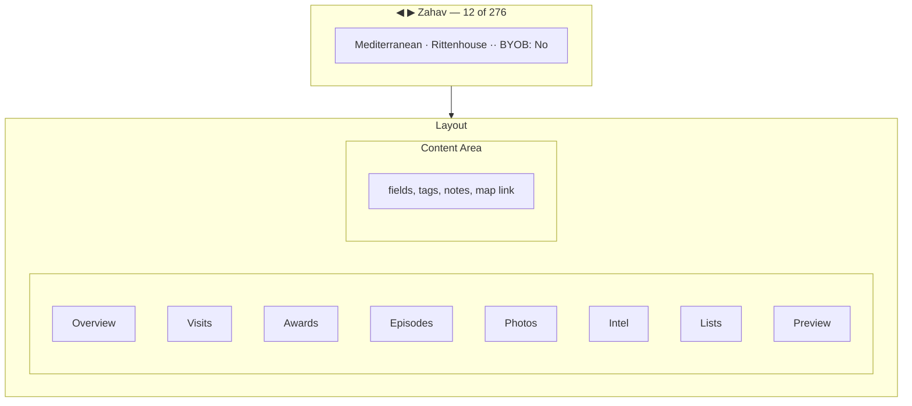
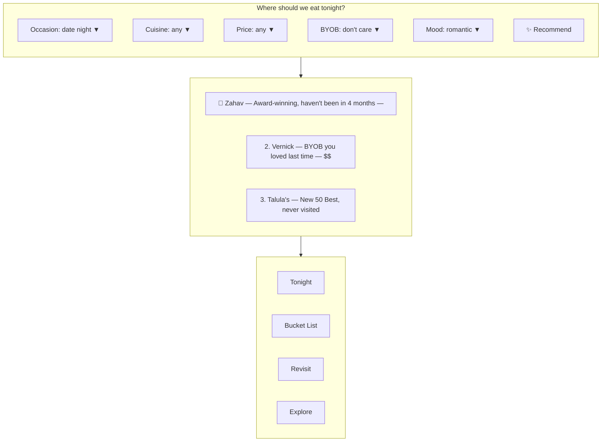
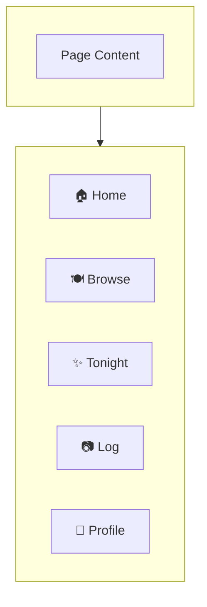
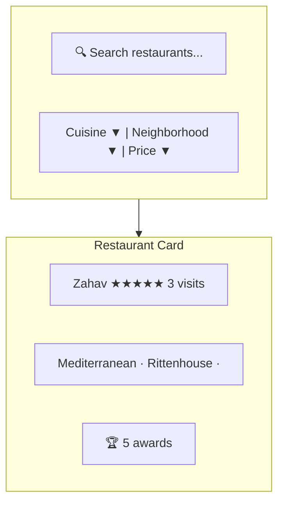
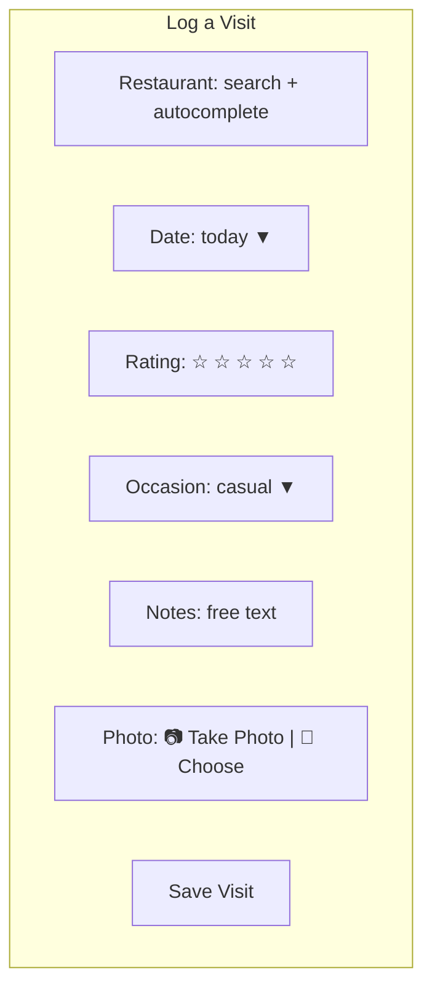
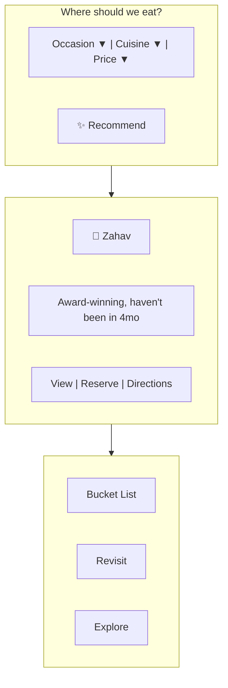

# User Interface

This chapter specifies the complete user interface for suppr — both the Wails desktop app and the mobile PWA. The two share a framework (React + Mantine 8) but have distinct layouts appropriate to their form factors.

---

## Desktop Wails App

### Header

	Title left, subtitle center, dark mode toggle right.



### Sidebar Navigation

	Uses `AppLayout` from `@trueblocks/ui` — the same component used by works, poetry, and siteman. Collapsible, resizable sidebar with icon + label items.

	**Implementation:** Each nav item is a `NavItem` object passed to `AppLayout`:

	```typescript
	interface NavItem {
	  id: string;
	  label: string;
	  icon: ElementType;  // Tabler icon component
	  badge?: number;     // optional count badge
	}
	```

	**Nav items (top section):**

| # | id | label | icon | Has Tabs | Hotkey |
|---|-----|-------|------|----------|--------|
| 1 | `dashboard` | Dashboard | `IconChefHat` | No | Cmd+1 |
| 2 | `restaurants` | Restaurants | `IconToolsKitchen2` | List / Detail | Cmd+2 |
| 3 | `visits` | Visits | `IconCalendarEvent` | List / Detail | Cmd+3 |
| 4 | `awards` | Awards | `IconTrophy` | List / Detail | Cmd+4 |
| 5 | `episodes` | Episodes | `IconDeviceTv` | List / Detail | Cmd+5 |
| 6 | `intel` | Intel | `IconNews` | List / Detail | Cmd+6 |

	**Nav items (bottom section, below divider):**

| # | id | label | icon | Has Tabs | Hotkey |
|---|-----|-------|------|----------|--------|
| 7 | `recommend` | Recommend | `IconSparkles` | No (wizard-style) | Cmd+7 |
| 8 | `settings` | Settings | `IconSettings` | Tabbed | Cmd+8 |

	**Sidebar behavior (from AppLayout):**
- Resizable via mouse drag (min: 56px icon-only, max: 300px, default: 220px)
- Collapses to icon-only mode when dragged below 80px threshold
- Width persisted via Go backend: `GetSidebarWidth()` / `SetSidebarWidth()`
- Re-clicking the active nav item cycles between list↔detail (for entities that have both)
- Bottom items separated from top by a `Divider`
- Active item visually highlighted
- Badge supported (e.g., Intel could show undismissed count)

---

### List/Detail Pattern (Platform Standard)

	Every entity page (Restaurants, Visits, Awards, Episodes, Intel) follows the same structural pattern from `@trueblocks/scaffold` and `@trueblocks/ui`:

	```
	XxxPage.tsx
	  └── NavigationProvider (from @trueblocks/scaffold)
	       └── TabView (from @trueblocks/ui — list | detail)
	            ├── XxxList.tsx (list tab)
	            │    └── DataTable (from @trueblocks/ui)
	            └── XxxDetail.tsx (detail tab)
	                 └── DetailHeader (from @trueblocks/ui)
	                      └── Sub-tabs (entity-specific)
	```

	**NavigationProvider** manages the navigation stack:
- `setItems(entityType, items, currentId)` — set the list for prev/next
- `setCurrentId(id)` — select an item
- `push(entityType, items, currentId, parentId)` — navigate into a sub-context (e.g., Restaurant → Visit)
- `pop()` — return to parent context
- `hasPrev` / `hasNext` / `goNext` / `goPrev` / `goHome` / `goEnd` — for DetailHeader arrows

	**TabView** manages the list↔detail toggle:
- Tab state persisted to Go backend via `GetTab(viewId)` / `SetTab(viewId, tab)`
- Active tab determined by whether a URL param (`:id`) is present
- `createPersistedTabContext` from `@trueblocks/ui` for app-wide tab state

	**DataTable** (list tab) provides:
- Multi-column sort (up to 4 levels)
- Column filters (dropdown, range, grouped)
- Global search with custom `searchFn`
- Pagination (20/50/100/250 per page)
- Row selection + keyboard navigation (via `useTableKeyboard`)
- Full state persistence (sort, search, filter, page, selected row) via `loadState` / `saveState`
- Delete/undelete with `ConfirmDeleteModal`
- Custom row styling via `getRowStyle`

	**DetailHeader** (detail tab) provides:
- Back button (returns to list)
- Prev/next arrows with position display ("12 of 276")
- Title area with icon + subtitle
- Action slots (left and right)
- Delete/undelete/permanent-delete buttons

	**useDetailPageNavigation** (from `@trueblocks/scaffold`) wires Arrow Left/Right, Home/End, and Cmd+Shift+Left hotkeys automatically for any detail page.

	**Sub-tabs on Detail views** use a vertical or horizontal tab pattern. Each entity's sub-tabs are specified in its Detail section below.

---

### Entity Sub-Tab Maps

	Complete sub-tab specifications for each entity's detail view:

#### Restaurant Detail Sub-Tabs

| # | Sub-Tab | Content | Editable |
|---|---------|---------|----------|
| 1 | **Overview** | Name, address, phone, website, status, cuisine, neighborhood, price range, BYOB, outdoor, reservations, tags (autocomplete), notes, map link | Yes (EditableField) |
| 2 | **Visits** | DataTable of this restaurant's visits. "Log Visit" button. | Via Visit Detail |
| 3 | **Awards** | DataTable of award appearances: source, year, rank, category | Read-only |
| 4 | **Episodes** | DataTable of Check Please! appearances + embedded video player when `embed_url` available | Read-only |
| 5 | **Photos** | Grid of photos. Upload button (opens file picker). Click to enlarge in modal. | Upload/delete |
| 6 | **Intel** | DataTable of intel items related to this restaurant. Dismiss button per row. | Dismiss only |
| 7 | **Lists** | Which lists contain this restaurant. Add/remove buttons. | Add/remove |
| 8 | **Preview** | Cached website preview in iframe. Refresh + Open in Browser buttons. | Refresh only |

#### Visit Detail Sub-Tabs

| # | Sub-Tab | Content | Editable |
|---|---------|---------|----------|
| 1 | **Overview** | Restaurant (link), date, who, rating (stars), occasion, spend, notes | Yes (EditableField) |
| 2 | **Photos** | Photos from this visit. Upload button. | Upload/delete |

#### Award Detail Sub-Tabs

| # | Sub-Tab | Content | Editable |
|---|---------|---------|----------|
| 1 | **Overview** | Restaurant (link), source, year, rank, category, url | Read-only |

#### Episode Detail Sub-Tabs

| # | Sub-Tab | Content | Editable |
|---|---------|---------|----------|
| 1 | **Overview** | Restaurant (link), season, episode number, air date, notes, embed_url | Read-only |
| 2 | **Video** | Embedded video player (when embed_url present) | — |

#### Intel Detail Sub-Tabs

| # | Sub-Tab | Content | Editable |
|---|---------|---------|----------|
| 1 | **Overview** | Restaurant (link), type, headline, body, source URL, discovered date, dismissed toggle | Dismiss + edit body |

---

### Dashboard

	At-a-glance stats and actionable items:



	Dashboard sections:
- **Stat Cards** (top row): Total restaurants, total visited, distinct cuisines, average rating
- **Recent Visits**: Last 3–5 visits with restaurant name, rating, date
- **Intel Alerts**: Undismissed intel items (closures, new awards, menu changes)
- **Bucket List**: Top 5 unvisited award-winning restaurants
- **Your Patterns**: Aggregate insights (favorite cuisine, favorite neighborhood, average spend)

---

### Restaurants — List Tab

	DataTable with sorting, filtering, search, persisted state.

| Column | Width | Sortable | Filterable | Notes |
|--------|-------|----------|------------|-------|
| Name | 30% | ✓ | search only | Primary display |
| Cuisine | 15% | ✓ | ✓ dropdown | |
| Neighborhood | 15% | ✓ | ✓ dropdown | |
| Price | 8% | ✓ | ✓ dropdown | $–$$$$ |
| Rating | 8% | ✓ | ✓ range | Avg from Visits |
| Awards | 8% | ✓ | ✓ range | Count of appearances |
| BYOB | 5% | ✓ | ✓ dropdown | Yes/No |
| Status | 8% | ✓ | ✓ dropdown | open/closed/seasonal |

	Click row → navigate to Restaurant Detail.

	Filter dropdowns loaded dynamically from the backend via `GetRestaurantFilterOptions()`.

---

### Restaurants — Detail Tab

	Detail view with vertical sub-tabs:



	**Sub-tabs:**

| Sub-Tab | Content |
|---------|---------|
| **Overview** | Address, phone, website, status, reservations, outdoor, tags, notes, map link — all `EditableField` components |
| **Visits** | DataTable of visits: date, who, rating, occasion, notes. "Log Visit" button. |
| **Awards** | DataTable of award appearances: year, rank, category. Read-only. |
| **Episodes** | DataTable of Check Please! appearances + embedded video player when `embed_url` available |
| **Photos** | Grid of photos. Upload button. Click to enlarge in modal. |
| **Intel** | DataTable of intel items. Dismiss button per row. |
| **Lists** | Which lists contain this restaurant. Add/remove buttons. |
| **Preview** | Cached website preview via local file server. Refresh + Open in Browser buttons. |

	Sub-tab cycling: `Option+Shift+2`.

---

### Visits — List Tab

| Column | Width | Sortable | Filterable |
|--------|-------|----------|------------|
| Restaurant | 25% | ✓ | search only |
| Date | 12% | ✓ | range |
| Who | 10% | ✓ | ✓ dropdown |
| Rating | 8% | ✓ | ✓ range |
| Occasion | 12% | ✓ | ✓ dropdown |
| Cuisine | 12% | ✓ | ✓ dropdown |
| Neighborhood | 12% | ✓ | ✓ dropdown |
| Notes | 9% | — | search only |

### Visits — Detail Tab

	Full visit record with DetailHeader (prev/next), restaurant link, all fields editable. "Return to Restaurant" button when navigated from a restaurant's Visits sub-tab.

---

### Awards — List Tab

| Column | Width | Sortable | Filterable |
|--------|-------|----------|------------|
| Restaurant | 30% | ✓ | search only |
| Source | 15% | ✓ | ✓ dropdown |
| Year | 10% | ✓ | ✓ dropdown |
| Rank | 10% | ✓ | ✓ range |
| Category | 20% | ✓ | ✓ dropdown |

---

### Episodes — List Tab

| Column | Width | Sortable | Filterable |
|--------|-------|----------|------------|
| Restaurant | 30% | ✓ | search only |
| Season | 10% | ✓ | ✓ dropdown |
| Episode | 10% | ✓ | ✓ range |
| Air Date | 15% | ✓ | range |
| Notes | 35% | — | search only |

---

### Intel — List Tab

| Column | Width | Sortable | Filterable |
|--------|-------|----------|------------|
| Restaurant | 25% | ✓ | search only |
| Type | 12% | ✓ | ✓ dropdown |
| Headline | 30% | ✓ | search only |
| Discovered | 12% | ✓ | range |
| Source | 12% | — | — |
| Dismissed | 9% | ✓ | ✓ dropdown |

---

### Recommend Page

	Wizard/tool UI — not a standard List/Detail.



	Each recommendation is a clickable card that navigates to Restaurant Detail. The #1 result is displayed prominently as THE answer — larger card, hero treatment. Results 2–5 are below in a compact list ("or if not that..."). The ideal UX is one-tap-one-answer: open the app, tap Tonight, get a restaurant. The secondary results exist for when the answer doesn't land.

---

### Tit-for-Tat UI (When Enabled)

	Tit-for-tat is **off by default**. When disabled, there is zero UI footprint — no indicator, no badge, no empty state message. It does not exist until both users enable it in Settings (mutual consent).

	When enabled, the UI is subtle:
- A small text line below the Recommend page's "Where should we eat tonight?" heading: `"Meriam's pick"` or `"Your pick"` — no icon, no animation, no color change
- The turn state is informational only — it influences the scoring algorithm but does not prevent either user from using any feature
- Either user can tap/click the turn indicator to waive their turn

---

### Settings Page

| Tab | Content |
|-----|---------|
| **General** | API server URL, API key display, home location (for distance calc), default search radius |
| **Preferences** | Dietary constraints, hard-no cuisines, hard-no neighborhoods |
| **Recommendation** | Tit-for-tat toggle (mutual consent), friend signal toggle, scoring weight adjustments |
| **Data** | Import/export database, photo sync status, backup info |

---

### Preview System (Desktop Only)

	Cached website previews rendered in an iframe via a local file server.

	**Flow:**
	1. User views Restaurant Detail → clicks Preview sub-tab
	2. Frontend calls `GetPreviewURL(restaurantID)`
	3. Backend checks local cache: `~/.local/share/trueblocks/suppr/cache/previews/{restaurantID}/`
	4. If cache miss or stale: fetch website, parse HTML, rewrite URLs to absolute, download key images, strip scripts, save cleaned HTML
	5. Backend returns: `http://127.0.0.1:{port}/preview/{restaurantID}/index.html?t={mtime}`
	6. Frontend renders in `<iframe>`

	**Cache structure:**
	```
	cache/previews/{restaurantID}/
	├── index.html          ← cleaned, rewritten HTML
	├── img/                ← downloaded images
	└── meta.json           ← fetch timestamp, original URL, status
	```

	**Local file server** starts on a dynamic localhost port during `App.Startup()`. Routes:
- `/preview/{restaurantID}/{path}` — serves cached HTML and images
- `/photos/{path}` — serves downloaded photos

	No X-Frame-Options blocking (we serve our own copy). Works offline after initial fetch. Scripts stripped for security.

---

### Command Palette (Cmd+Shift+P) — Desktop Only

	Fuzzy-searchable list of actions (not data). Distinct from global search (Cmd+K).

| Command | Shortcut |
|---------|----------|
| Go to Dashboard | Cmd+1 |
| Go to Restaurants | Cmd+2 |
| Go to Visits | Cmd+3 |
| Go to Awards | Cmd+4 |
| Go to Episodes | Cmd+5 |
| Go to Intel | Cmd+6 |
| Go to Recommend | Cmd+7 |
| Go to Settings | Cmd+8 |
| Search | Cmd+K |
| Reload View | Cmd+R |
| Toggle Dark Mode | — |
| Toggle Show Deleted | Cmd+Shift+D |

	Arrow Up/Down + Enter to execute. Escape to close. Each command shows its keyboard shortcut right-aligned.

---

### Global Search Modal (Cmd+K)

	Searches across all entity types:
- Restaurants (by name, cuisine, neighborhood)
- Visits (by restaurant name, notes)
- Intel (by headline, restaurant name)

	Results grouped by type with icons. Click → navigate to entity detail.

---

### Hotkeys (Complete Registry)

	These follow the platform pattern established by works. All are registered via `useHotkeys` from `@mantine/hooks` (re-exported via `@trueblocks/ui`). The hook is called in `useKeyboardShortcuts.ts` (global) and in individual page components (context-specific).

#### Global Hotkeys (registered in App.tsx / useKeyboardShortcuts.ts)

| Key | Action | Notes |
|-----|--------|-------|
| Cmd+1 | Navigate to Dashboard | If already on Dashboard, no-op |
| Cmd+2 | Navigate to Restaurants | If already there, cycle list↔detail |
| Cmd+3 | Navigate to Visits | If already there, cycle list↔detail |
| Cmd+4 | Navigate to Awards | If already there, cycle list↔detail |
| Cmd+5 | Navigate to Episodes | If already there, cycle list↔detail |
| Cmd+6 | Navigate to Intel | If already there, cycle list↔detail |
| Cmd+7 | Navigate to Recommend | |
| Cmd+8 | Navigate to Settings | |
| Cmd+K | Open global search modal | |
| Cmd+Shift+P | Open command palette | |
| Cmd+R | Reload current view | Dispatches `reloadCurrentView` CustomEvent |
| Cmd+Shift+D | Toggle show deleted items | Persisted in state.json |
| Option+Shift+D | Toggle debug mode | |

#### DataTable Hotkeys (registered in useTableKeyboard from @trueblocks/ui)

| Key | Action | Condition |
|-----|--------|-----------|
| Arrow Down | Select next row | Focus in table |
| Arrow Up | Select previous row | Focus in table |
| Home | Select first row | Focus in table |
| End | Select last row | Focus in table |
| Enter | Open selected row (navigate to detail) | Row selected |
| Arrow Left | Previous page | Not in an input field |
| Arrow Right | Next page | Not in an input field |
| Cmd+/ | Focus search box | |

#### Detail Page Hotkeys (registered via useDetailPageNavigation from @trueblocks/scaffold)

| Key | Action | Condition |
|-----|--------|-----------|
| Arrow Right | Next item | Not in an input field |
| Arrow Left | Previous item | Not in an input field |
| Home | First item | Not in an input field |
| End | Last item | Not in an input field |
| Cmd+Shift+Left | Return to list | |
| Cmd+Shift+Up | Return to list (alias) | |

#### Restaurant Detail Hotkeys

| Key | Action |
|-----|--------|
| Option+Shift+2 | Cycle sub-tabs (Overview → Visits → Awards → … → Overview) |
| Cmd+O | Open restaurant website in default browser |

#### Recommend Page Hotkeys

| Key | Action |
|-----|--------|
| Option+Shift+2 | Cycle sub-tabs (Tonight → Bucket List → Revisit → Explore → Tonight) |

#### Implementation Notes

- Hotkey combos use `mod` (Cmd on macOS, Ctrl on Windows/Linux) internally via Mantine's `useHotkeys`
- Detail page navigation hotkeys suppress when focus is inside an `<input>`, `<textarea>`, or `[contenteditable]`
- The "cycle list↔detail" behavior on Cmd+1–8 mirrors works exactly: pressing the hotkey for the current nav item toggles between list and detail views using `TabView`'s tab switching
- `reloadCurrentView` is a CustomEvent dispatched on `window` — each page listens and re-fetches data
- The platform convention: every navigable view has a Cmd+N hotkey. Every sub-tab group cycles with Option+Shift+N. Every detail page gets Arrow Left/Right/Home/End for free via `useDetailPageNavigation`

---

### State Persistence (Six Types)

| # | What | How |
|---|------|-----|
| 1 | Window position/size | `useWindowGeometry()` |
| 2 | Sidebar width | `GetSidebarWidth()` / `SetSidebarWidth()` |
| 3 | Last route | `GetLastRoute()` / `SaveLastRoute()` |
| 4 | Active tab per view | `SetTab(viewId, tab)` |
| 5 | Full route per tab | `SetTabRoute(key, route)` |
| 6 | Table state (sort/search/filter) | Handled by `createDataTable` wrapper |

	All stored locally in `state.json` via `appkit.Store`. Not synced to the server.

---

### Cross-Navigation Patterns

	Navigation between related entities preserves return context:

- Restaurant Detail → Visits sub-tab → click visit → Visit Detail (with "Return to Zahav" button)
- Visits list → click visit → Visit Detail → click restaurant name → Restaurant Detail (with "Return to Visits" button)
- Dashboard → click bucket list item → Restaurant Detail (with "Return to Dashboard" button)
- Recommend → click recommendation → Restaurant Detail (with "Return to Recommend" button)

	Uses `location.state` with `returnTo` and `returnLabel` fields.

---

### Status Bar

	Bottom-left status messages:
- Info (data loaded counts)
- Progress (photo uploading, data syncing)
- Success (visit logged, restaurant updated)
- Error (API unreachable, upload failed)

---

### Component Architecture

	```
	src/pages/
	├── DashboardPage.tsx
	├── RestaurantsPage.tsx          ← TabView + NavigationProvider
	├── RestaurantsList.tsx
	├── RestaurantDetail.tsx         ← DetailHeader + sub-tabs
	├── VisitsPage.tsx
	├── VisitsList.tsx
	├── VisitDetail.tsx
	├── AwardsPage.tsx / AwardsList.tsx / AwardDetail.tsx
	├── EpisodesPage.tsx / EpisodesList.tsx / EpisodeDetail.tsx
	├── IntelPage.tsx / IntelList.tsx / IntelDetail.tsx
	├── RecommendPage.tsx            ← Wizard UI
	└── SettingsPage.tsx             ← Tabbed settings

	src/components/
	├── DataTable.tsx                ← createDataTable wrapper
	├── RestaurantSubTabs/           ← Overview, Visits, Awards, etc.
	└── RecommendTabs/               ← Tonight, BucketList, Revisit, Explore
	```

---

## Mobile PWA

	The phone experience is tailored for mobile use cases: quick lookup, log a visit, snap a photo, browse recommendations. It is **not** a miniaturized desktop app.

### Navigation

	Bottom tab bar (standard iOS pattern):



| Tab | Purpose |
|-----|---------|
| **Home** | Dashboard lite: recent visits, intel alerts, quick stats |
| **Browse** | Restaurant list (searchable, filterable). Tap → detail. |
| **Tonight** | Recommendation wizard with filters |
| **Log** | Quick-log a visit: pick restaurant, rate, snap photo, notes |
| **Profile** | Your visits, lists, stats, settings |

### Browse → Restaurant List (Mobile)

	Card list with search bar and filter chips. No DataTable — cards are thumb-friendly.



### Browse → Restaurant Detail (Mobile)

	Stacked collapsible cards (not sub-tabs):

- Header: name, cuisine, neighborhood, price, rating
- Info: address, phone, website, BYOB, reservations
- Awards (count + list)
- Photos (grid + [+Add] button → camera)
- Your Visits (list + [+Log] button)
- Intel

### Log a Visit (Mobile — Primary Use Case)

	Must be fast and frictionless:



	Camera via `<input type="file" accept="image/*" capture="environment">` — opens iPhone camera directly.

### Tonight (Mobile Recommendations)

	Same concept as desktop but simplified:



	"Directions" opens Apple Maps. "Reserve" opens the restaurant's reservation platform if known.

### Photos on PWA

	The PWA is always online. It:
- **Reads** photos from the server (no local cache, no sync)
- **Uploads** photos to the server (from camera or photo library)

	No offline photo viewing. No sync protocol needed for the PWA.

---

## Shared vs. Separate Frontends

| Aspect | Desktop (Wails) | Mobile (PWA) |
|--------|----------------|--------------|
| Framework | React + Mantine 8 | React + Mantine 8 |
| Routing | react-router-dom | react-router-dom |
| Layout | Sidebar + content area | Bottom tab bar + content |
| Components | DataTable, DetailHeader, EditableField | Simplified cards, forms |
| State persistence | Backend via Wails (state.json) | localStorage |
| Build tool | Wails (embeds in Go binary) | Vite (static, served by DO) |
| Preview system | Yes (local file server) | No |
| Command palette | Yes (Cmd+Shift+P) | No |

	**Recommendation**: Separate frontends, shared TypeScript types. The layouts are too different to share components. But API response types and error handling should be shared via a common `types.ts`.
